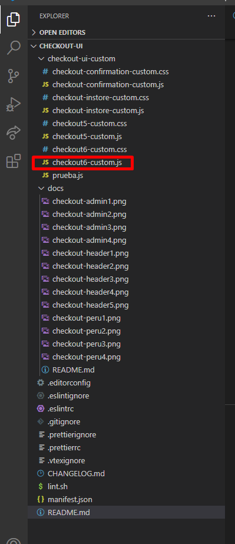

## CHECKOUT UI CUSTOM 🍂

## Screenshots 📸

## Config admin

### Custom checkout options


### custom checkout colors


- The component should not be added to dependencies, for it to be displayed the linking or installation must be carried out in the workspace that you want to work on or master.

## Form structure.

The structure of the form is currently delimited as follows:


## Formulario de varios pasos y Javascript.

The checkout component in your form shows progressive steps as it is filled out, it is loaded in the JS file called **checkout6-custom** along with it there are also the functions to add placeholders, icons on the cards and character limit on the inputs. These last three functions are found within a checking call.



## Configuration

1. Using your terminal and the [VTEX IO Toolbelt](https://vtex.io/docs/recipes/development/vtex-io-cli-installment-and-command-reference), login into the desired VTEX account.
2. Run `vtex install vtex.checkout-ui-custom` on the account you're working on.
3. Access your VTEX account's admin.
4. Access **Store Setup** and then **Checkout UI Custom**.
5. Make the desired changes using the interface and click on `Publish`.

ℹ️ \_Once the app is installed in your account, the `checkout6-custom.js` and `checkout6-custom.css` files will be replaced by the ones generated by this app.*
    
 ```
const checking = () => {

  let cont = 0;

  if(window.location.href.includes("checkout/#/email") || window.location.href.includes("checkout/#/shipping") || window.location.href.includes("checkout/#/payment")){

      let id =  setInterval(function () {

                      changePlaceHolders()
                      changeTarjetasIcons()
                      limitAddressField()

                      cont++;

                      if(cont > 3 && ($('#ship-street').length > 0 || $('.step.accordion-group.store-country-COL.active').length > 0 || $('#client-document').length > 0)) clearInterval(id)

                  }, 1500)

  }

}
   ``` 

### freeshipping

Like the previous functions, the freeshipping meter is created in the JS file, where the price to be delimited as free shipping is added, which is configured as **59000 Chilean pesos**.

 ```
$(window).on('orderFormUpdated.vtex', function (evt, orderForm) {
  addTextCar()

  if (orderForm.value > 0) {
    $('#container-progressbar, .message-bar').remove()
    const costoEnvioArray = orderForm.totalizers
    let costoEnvioDecimal = ' '
    const costoEnvioTotal = () => {
      costoEnvioArray.forEach(function (el, index) {
        if (orderForm.totalizers[index].name == 'Costo total del envío')
          costoEnvioDecimal = orderForm.totalizers[index].value
      })
      return costoEnvioDecimal / 100
    }
    let precioBase = orderForm.value / 100
    let range
    range = precioBase - costoEnvioTotal()
    let percentbar = (range / 59000) * 100

    $('.summary-template-holder').append(
      "<div id='container-progressbar'><div id='progressbar'><p id='icon'></p><div></div></div></div>"
    )

    if (range <= 58000) {
      let valor = 59000 - range

      valor = new Intl.NumberFormat('de-DE').format(valor)

      $('#progressbar > div').css('width', percentbar + '%')

      $('#container-progressbar').append(`<p class="message-bar">¡Solo te quedan <span>S/ ${valor}</span>!</p>`)
    }

    if (range >= 59000) {
      $('#progressbar, .message-bar ').remove()

      $('#container-progressbar').append(`<p class="message-bar">¡Ya tienes envío gratis!</p>`)
    }
  } else {
    $('.container-message--car').remove()
  }
})

   ``` 


### Header and Footer.

Even though the component is installed, the header and footer are still being manipulated from the admin, to locate it we must enter the following specific path shown below:


Once we are in this position of the menu, we can select both the checkout-footer and the checkout-header where we can see the html of each section, as shown below:


### CSS

The interface modifications made are located in the **checkout6-custom.css** file, remembering that the main colors are recommended to be worked on in the checkout configuration panel as presented in previous points.


<!-- DOCS-IGNORE:start -->

## Contributors ✨

Thanks goes to these wonderful people:

- Vladimiro Ballesteros 
- Luis Correa
- Carlos Deseda
